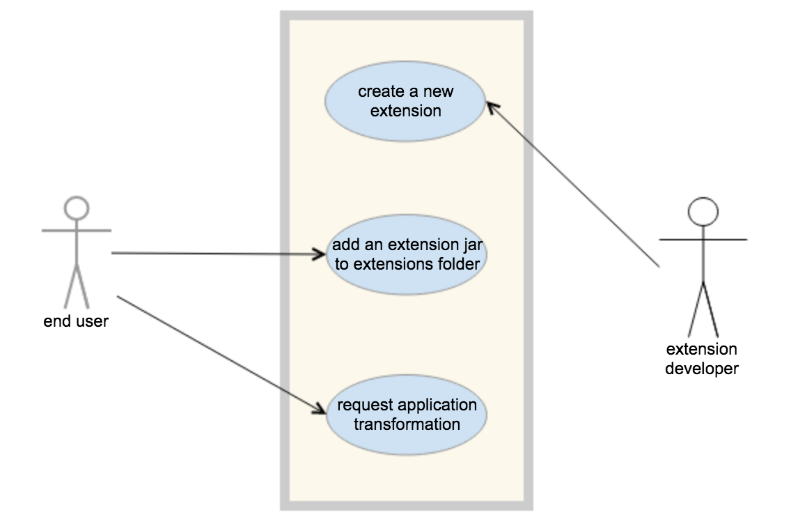
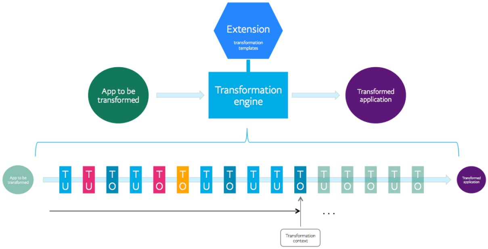
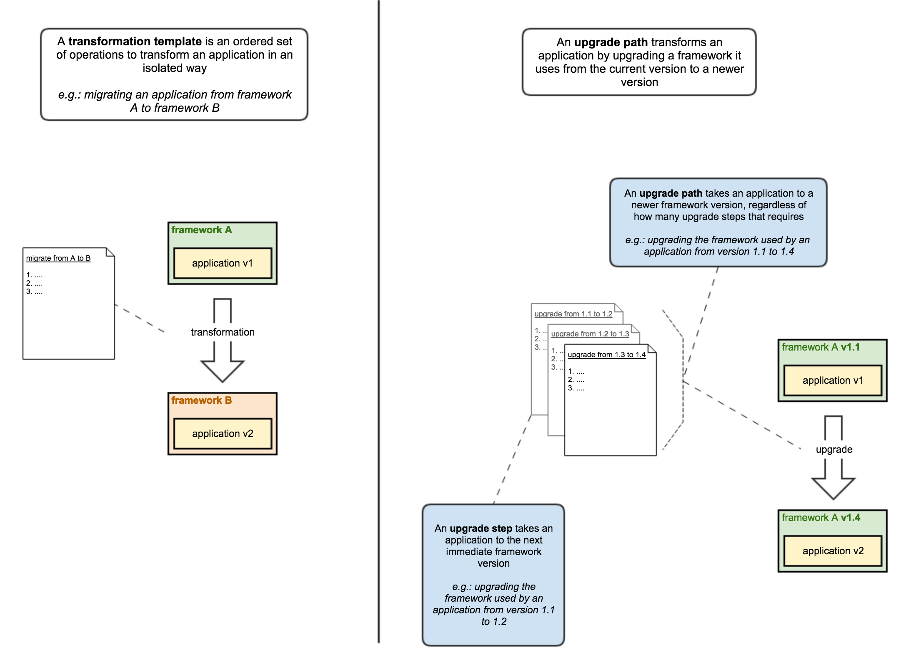

# Extension development guide

This page documents Butterfly extensions API, allowing development of transformation templates, and also custom transformation utilities and operations.

## What is a Butterfly extension?

**Transformation template** is a set of operations to be applied against any application, and **Butterfly extensions** are the vehicles to define transformation templates, and to also plug them into Butterfly. Once plugged into Butterfly, Butterfly transformation engine can utilize any available transformation template to transform an application.

Without an extension, Butterfly is solely a **transformation engine**, and is unable to transform any application.

As an analogy, if **Butterfly is a cook**, then **the recipe is the transformation template**, and **the extension is the cookbook**.

### Speaking in technical terms

Butterfly offers a **Service Provider Interface (SPI)** allowing the **transfomration engine** to be completely detached from **transformation templates**. This flexible architecture allows anyone to write transformation templates and plug them easily into Butterfly.

This SPI is represented by [butterfly-extensions-api](https://paypal.github.io/butterfly/javadocs/2.2.0/butterfly-extensions-api/index.html).

### How to install an extension

Every Butterfly extension is packaged in a jar file. Read [Installing an extension](https://paypal.github.io/butterfly/Installing-Butterfly) to find out how to install a Butterfly extension. 

### Playing with a sample extension

If you are not ready yet to develop your own Butterfly extension, you can install a sample extension, following [Quick Start](https://paypal.github.io/butterfly/QUICK_START), and use it to play with Butterfly.

## Use cases

The diagram below illustrates the possible actors and use cases in Butterfly.

## Butterfly terminology

1. **Application**: the application to be transformed
1. **Operation (AKA transformation operation, or TO)**: a single modification in an application (e.g. removing a file, or adding a new dependency into a pom file)
1. **Transformation template**: a set of operations to be applied against any application
1. **Transformation**: the act of applying a transformation template against a specific application, which results in a transformed application
1. **Migration**: there is nothing special in a migration, it is basically a transformation, and the fact that the result will be a migrated application is transparent to Butterfly (although it is relevant to the end user)
1. **Upgrade step**: a special type of transformation template that takes an application from one minor version to the next subsequent available version
1. **Upgrade path**: an ordered set of upgrade steps to take an application from one version to any newer version (including every upgrade step in between those two versions)
1. **Upgrade**: the act of applying an upgrade path against a specific application, which results in an upgraded application
1. **Butterfly input**: information about the application to be transformed and the transformation template to be applied
1. **Butterfly configuration**: configuration such as a specific output folder to plate the transformed application and to whether zip or not it
1. **Butterfly extension**: a third-party Butterfly package that contains transformation templates, upgrade templates and/or upgrade paths, besides also optionally validation implementations
1. **End user**: this is the person that uses Butterfly to transform an application (by using transformation templates within a particular extension)
1. **Extension developer**: this is the person that creates 3rd party Butterfly extensions, containing transformation templates and optionally also custom validations
1. **Validation**: there are two types of validations, "pre" and "post" transformation. The first make sure the application is eligible to be transformed, and the second makes sure the transformation was successful
1. **Butterfly transformation engine**: the mechanism that performs application transformations based on transformation templates
1. **Transformation pipeline**: sequence of transformation utilities (and operations) defined by the transformation template to be executed by the transformation engine
1. **Utility (AKA transformation utility, or TU)**: key Butterfly element, gathering data about the project to be transformed, without applying any modification on it
1. **Transformation context**: object shared among all utilities containing information about the application being transformed, as they are gathered by utilities, plus extra meta-data

## Transformation process and pipeline

The diagram below pictures the transformation process, whose core element is the **transformation engine**, which executes **transformation templates** defined in a particular **extension**, transforming the application.

The transformation is executed through a **pipeline** made of a sequence of **transformation utilities (TU)** and **transformation operations (TO)** defined by the transformation template.

Notice in the diagram below a horizontal line under the pipeline, showing which operation is being executed at the moment. Notice also that each utility or operation executed always has access to the **transformation context**, which is an object shared among all utilities containing information about the application being transformed, as they are gathered by utilities, plus extra meta-data.

The colors in the pipeline represent the possible states, meaning:

1. Light green: not performed yet
1. Dark blue: a successfully executed TO
1. Light blue: a successfully executed TU
1. Yellow: a TU or TO that has executed succesfully, but not without producing a warning
1. Red: a TU or TO that has executed resulting in a non-fatal error

## Differences between TO and TU

**Transformation Operation (TO)** is a specialized type of **Transformation Utility (TU)**.
Here are the differences between them:

1. TU never modifies application. TO always does.
1. TU usually returns a value, but not necessarily. TO never does.
1. TU usually saves its result in the transformation context object, but not necessarily. TO always does.

#### Values and results

The terms "value" and "result" above are not interchangeable.

- **Value** refers to an actual data that is obtained or generated by a TU (as a result of "learning something" about the application) and that can be useful for following TUs and TOs to be executed.
- **Result** refers to the internal Butterfly meta-data type to represent the execution result type of a TU or TO, for example, stating if it was successful, if it failed, if it was skipped, etc. 

Both value and result are stored in the transformation context.

## Transformation template types

The diagram below exemplifies the differences between transformation template and upgrade templates, besides representing also upgrade steps and upgrade paths.

## Running Butterfly CLI from an IDE

When developing a Butterfly extension, it is very helpful to run it from the IDE. To do so, add class-path entries for your extension jar and run class `com.paypal.butterfly.cli.ButterflyCliApp`, from `butterfly-cli` jar, passing the required command line arguments.

## Butterfly javadocs

Refer to the following javadocs to develop your own Butterfly extension:

1. [butterfly-extensions-api](https://paypal.github.io/butterfly/javadocs/2.2.0/butterfly-extensions-api/index.html): API component to be used by Butterfly extensions when providing their transformation and upgrade templates.
1. [butterfly-utilities](https://paypal.github.io/butterfly/javadocs/2.2.0/butterfly-utilities/index.html): multiple types of ready-to-use transformation utilities.
