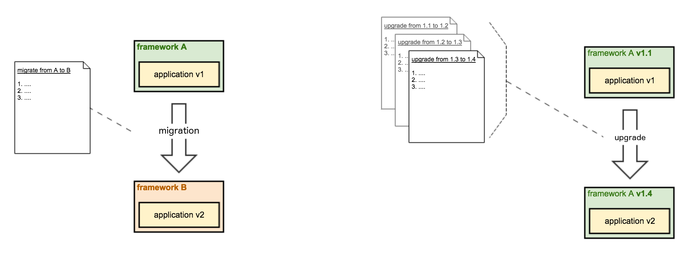

  

 

Butterfly is an application code transformation tool, and commonly it is used to perform **automated application migrations**, **upgrades** and **source code and configuration changes**.

# The transformation problem

Application changes, upgrades and migrations are usually complex, time-consuming and error prone.
Therefore, they are also extremely expensive in the short term, and might even cause worse problems (and much more expensive) in long term.

# Transformation automation

By automating application source code transformations, upgrades and migrations, overall development experience and software maintenance are improved.
In addition to that, for a given organization, the number of applications in the latest version of a particular framework is increased, and the upgrade and migration processes are simplified.

# Common use cases

## Automated application framework migrations

An organization has multiple applications developed using a particular framework as foundation. One day that framework becomes obsolete, and it is replaced by a brand new one, more modern. At this point, it is difficult and expensive to ensure all applications will **migrate** to the new framework.

This organization could use Butterfly, combined with its own Butterfly extension, to automate application migrations.

## Automated application framework upgrades

An organization has multiple applications developed using a particular framework as foundation. As newer framework versions are available, it is difficult and expensive to ensure all applications will **upgrade** to the latest framework version.

This organization could use Butterfly, combined with its own Butterfly extension, to automate application upgrades.

## Automated application changes

An organization has multiple applications developed using a particular framework as foundation. One day, a security issue is found affecting all applications, and the solution demands a code or configuration change in each application. In this situation it would be difficult and expensive to ensure all applications **apply those changes** correctly.

This organization could use Butterfly, combined with its own Butterfly extension, to automate application changes.

# Butterfly Features

* Automated application source code transformations
  * Application upgrades
  * Application migrations
  * Source code and configuration changes
* Plugable mechanism for Butterfly extensions, containing transformation and/or upgrade templates
* Multiple types of ready-to-use transformation utilities, including for example manipulating text, properties, XML, POM and Java files
* Resilient transformation pipeline
  * Shared context among transformation utilities
  * Error handling
  * Dependency management among transformation utilities
  * Conditional transformation utilities
* Transformation utilities execution in different modes and fashions
  * Configurable utilities
  * Anonymous utilities
  * Multiple execution
  * Group execution
  * In-loop execution
* Post-transformation features
  * Manual steps Reporting
  * Metrics
* APIs
  * Extensions API
  * API for custom transformation utilities and operations
  * Facade for Java application integration
* Command-Line-Interface tool
* Logging in silent or verbose mode, in info or debug level, and on console or file

# Quick start
Read [Butterfly Quick Start](https://paypal.github.io/butterfly/QUICK_START) to learn how to use Butterfly by transforming a sample application.

# Butterfly User Guide

1. [Installing Butterfly](https://paypal.github.io/butterfly/Installing-Butterfly)
1. [Running Butterfly](https://paypal.github.io/butterfly/Running-Butterfly)
1. [Extension development guide](https://paypal.github.io/butterfly/Extension-development-guide)
1. [Design documents](https://paypal.github.io/butterfly/Design-documents)
